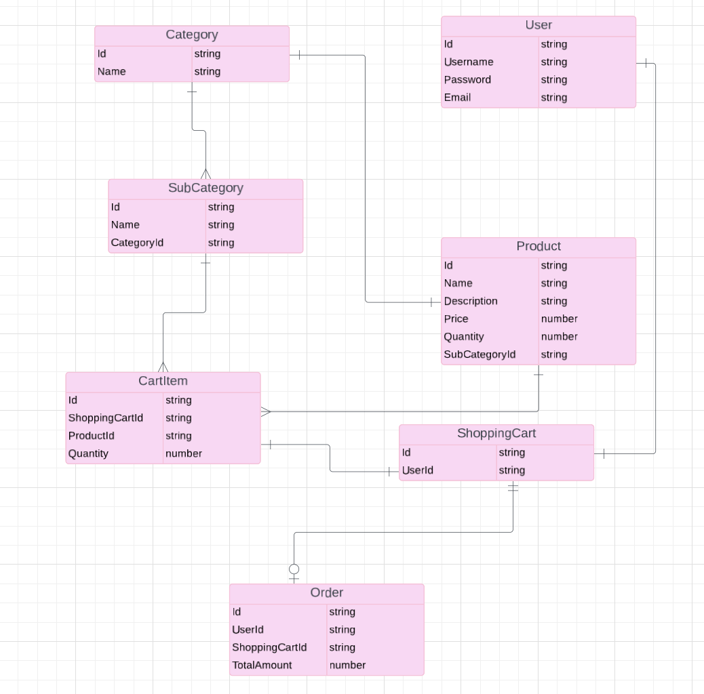

Wendy Silva
# My App Proposal

## Project Choice

```Workout Clothes App```

## Project Description

For my Unit 2 Project, I am developing a workout clothes app utilizing EJS templates, CSS, JavaScript, and JSON. The app will feature user-friendly sign-up and sign-in functionality, allowing users to browse a diverse selection of workout clothes for both men and women. Users will also be able to add items to their cart for a seamless shopping experience. Future enhancements will include integrating a payment form and enabling user reviews.

## Wire Frame


## User Story                                                         

***MVP Goals:***

- As a User, I want to be able to sign up for an account.

- As a User, I want to be able to log in and log out.

- As a User, I want to browse workout clothes.

- As a User, I want to view information about the product.

- As a User, I want to add items to my cart.

- As a User, I want to be able to add, edit, and delete products.


***Stretch Goals:***

- As a User, I would like to check out to complete purchase.

- As a User, I would like to be able to leave reviews.

- As a User, I would like to be able to apply a discount code.

## ERD




## Route Table

| HTTP Method | Path              | CRUD                                           | Route Name                 |
|-------------|-------------------|------------------------------------------------|----------------------------|
| POST        | `/auth/sign-up`   | Create: Make new user                          | `registerUser`             |
| POST        | `auth/sign-in`    | Create: Authenticate a user                    | `loginUser`                |
| GET         | `/products`       | Read: Get all products                         | `getAllProducts`           |
| GET         | `/products/:id`   | Read: Get a single product by ID               | `getProductById`           |
| POST        | `/cart`           | Create: Add an item to the cart                | `addToCart`                |
| GET         | `/cart`           | Read: Get all items in the cart                | `getCartItems`             |
| PUT         | `/cart/:id`       | Update: Edit quantity of an item in the cart   | `updateCartItem`           |
| DELETE      | `/cart/:id`       | Delete: Remove an item from the cart           | `removeCartItem`           |


## Timeline

|    Day    	|                           Task                           	|  
|:---------:	|:--------------------------------------------------------:	|
|   Friday  	| Create and present proposal                              	|
|  Saturday 	| Create ejs, css, js files, and create basic structure.  	|
|   Sunday  	| Begin functions                                          	|
|   Monday  	| Continue functions                                       	|
|  Tuesday  	| Add style                                                	|
| Wednesday 	| Finalize functions                                       	|
|  Thursday 	| Begin stretch goals                                      	|
|   Friday  	| Overview and launch project                             	|
|  Saturday 	| Review                                                	|
|   Sunday  	| Review                                                   	|
|   Monday  	| Present Project                                          	|             
